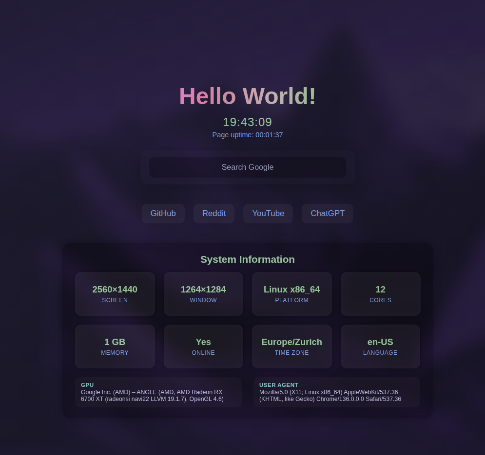

Here's an updated version of your README with polished formatting, improved clarity, and a direct link to the live demo:

---

# 🏠 Custom Home

A fully customizable, modern new tab or homepage built with **vanilla HTML, CSS, and JavaScript** — no frameworks, no servers, just fast and simple.

[👉 Live Demo](https://weykn.github.io/home/)



---

## ✨ Features

* 🔧 **In-browser settings panel**
  No server or account needed — everything is stored locally.

* 🎨 **Fully customizable design**
  Change background gradient, font styles, shimmer effects, and more.

* 🕒 **Live clock**
  Toggle 12/24-hour format, show or hide seconds.

* ⏱️ **Uptime counter**
  See how long the page has been open.

* 💻 **System info**
  Displays resolution, platform, memory, GPU, and more.

* 🔎 **Custom search bar**
  Set your own search engine and placeholder text.

* 🔗 **Quick links manager**
  Add, edit, or remove links with optional target (same/new tab).

---

## 🚀 Getting Started

1. Open the [Live Demo](https://weykn.github.io/home/).
2. Click the ⚙️ icon to access the settings panel.
3. Customize the layout, colors, links, and more — changes are saved automatically in your browser.

---

## 📂 Local Usage

You can also download and run it locally:

```bash
git clone https://github.com/weykn/home.git
cd home
open index.html  # or just drag it into your browser
```

---

## 🛠 Tech Stack

* HTML5
* CSS3 (flexbox, gradients, custom properties)
* Vanilla JavaScript (ES6+, localStorage)
